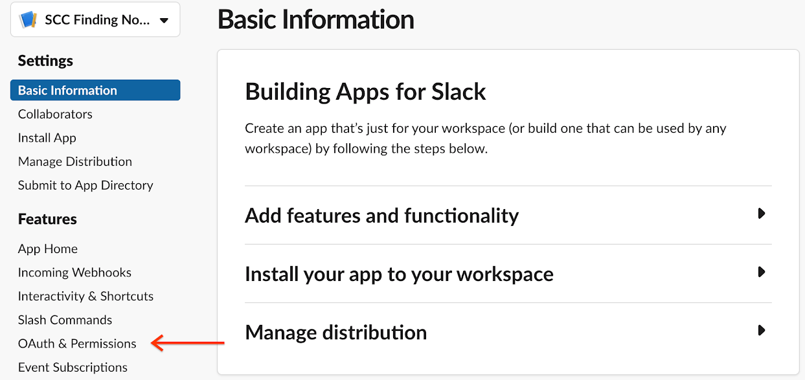
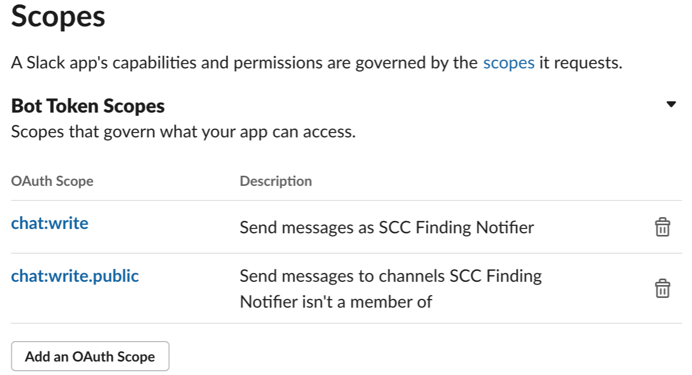
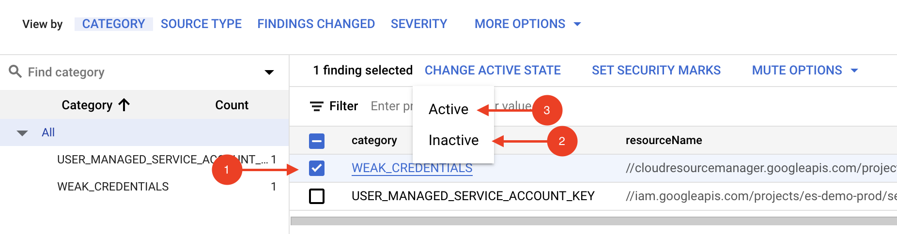
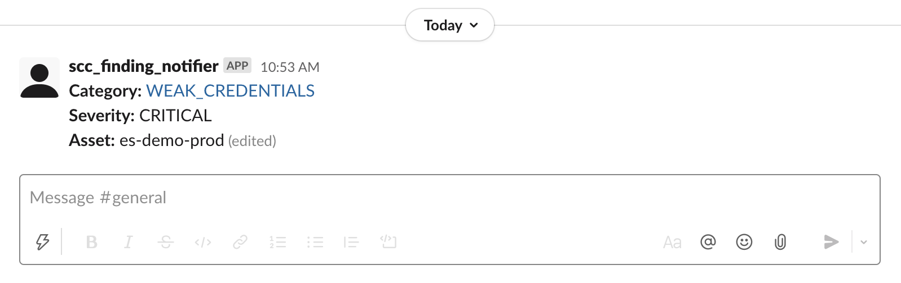

# Send Slack Message on High Severity Finding Notifications

This repository provides a GCP cloud function that will send a slack notification when a finding is published to GCP's Security Command Center.

## Overview

- Generate a Slack API token that will authorize our cloud function to make API calls to Slack.
- Configure Security Command Center to publish notifications to Cloud Pub/Sub when findings are created or updated.
- Create and deploy a cloud function that subscribes to Cloud Pub/Sub and sends Slack messages when notifications are received from the Cloud Pub/Sub topic.

## Step-by-Step

### Generate a Slack API Token

In this section, we will generate a Slack API token that will authorize our cloud function to create and update Jira tickets in an Atlassian Cloud instance.

1. Navigate to [Slack API apps](https://api.slack.com/apps).

1. Sign in or create an account.

1. Select **_Create an App_**.

1. Set **_App Name_** to `SCC Finding Notifier`.

1. Select the **_Development Slack Workspace_** where you'd like the Slack Bot to post messages, and then click **_Create App_**.

1. In the navigation panel, select **_OAuth & Permissions_**.

   

1. Navigate to the **_Scopes_** section. Under **_Bot Token Scopes_**, click **_Add an OAuth Scope_** and enter:

   - `chat:write`
   - `chat:write.public`

   

1. Scroll to the top of the **_OAuth & Permissions_** page and click **_Install App to Workspace_**.

1. In the confirmation dialog, click **_Allow_**.

1. Copy the **_Bot User OAuth Access Token_** for use in the Cloud Function.

### Open a Terminal

The rest of this tutorial will be performed in a terminal.

1. Open a [Cloud Shell Console](https://ssh.cloud.google.com/cloudshell/editor), or a shell with the [gcloud CLI](https://cloud.google.com/sdk/gcloud) installed.

1. Clone this repository locally and make it the current working folder.

   ```shell
   git clone https://github.com/shadanan/gcp-scc-finding-notification-slack.git
   cd gcp-scc-finding-notification-slack
   ```

1. Set the org and project ID. The selected project is where the cloud function will execute form.

   ```shell
   export ORG_ID=<your org id>
   export PROJECT_ID=<your project id>
   gcloud config set project $PROJECT_ID
   ```

### Configure the Pub/Sub Topic and Subscription

Cloud Pub/Sub is a real-time messaging service that enables messages to be sent and received between independent applications. A publisher creates a message and publishes it to a feed of messages called a topic. A subscriber receives these messages by way of a subscription. In our case, we'll have a cloud function that updates Jira when SCC finding notifications are published to the topic.

1. Create the topic where all the findings will be published.

   ```shell
   export TOPIC=scc-critical-and-high-severity-findings-topic
   gcloud pubsub topics create $TOPIC
   ```

1. Configure SCC to publish notifications to our topic.

   ```shell
   gcloud scc notifications create scc-critical-and-high-severity-findings-notify \
     --organization $ORG_ID \
     --pubsub-topic projects/$PROJECT_ID/topics/$TOPIC \
     --filter '(severity="HIGH" OR severity="CRITICAL") AND state="ACTIVE"'
   ```

### Create a Service Account for our cloud function

In this section, we'll provision a service account that will be used by our cloud function. These instructions are adapted from the [public documentation](https://cloud.google.com/security-command-center/docs/how-to-programmatic-access).

1. Create the service account.

   ```shell
   export SERVICE_ACCOUNT=slack-cloud-function-sa
   gcloud iam service-accounts create $SERVICE_ACCOUNT \
     --display-name "SCC Finding Notifier Slack cloud function" \
     --project $PROJECT_ID
   ```

1. Grant the service account the `securitycenter.admin` role for the organization.

   ```shell
   gcloud organizations add-iam-policy-binding $ORG_ID \
     --member="serviceAccount:$SERVICE_ACCOUNT@$PROJECT_ID.iam.gserviceaccount.com" \
     --role='roles/securitycenter.admin'
   ```

### Save Slack API Token in Secrets Manager

1. Export the Slack API Token into an environment variable.

   ```shell
   export SLACK_API_TOKEN=<your-app-secret>
   ```

1. Create the token.

   ```shell
   gcloud secrets create slack-api-token
   ```

1. Set the value of the token.

   ```shell
   echo -n $SLACK_API_TOKEN | gcloud secrets versions add slack-api-token --data-file=-
   ```

1. Grant the service account access to the token.

   ```shell
   gcloud secrets add-iam-policy-binding slack-api-token \
     --member="serviceAccount:$SERVICE_ACCOUNT@$PROJECT_ID.iam.gserviceaccount.com" \
     --role='roles/secretmanager.secretAccessor'
   ```

### Publish the Cloud Function

1. Deploy the `slack-high-and-critical-findings` cloud function. If you have not enabled Cloud Build API, then this command may fail. Follow the link in the error message to enable it and then try again.

   ```shell
   gcloud functions deploy slack-high-and-critical-findings \
     --entry-point=process_notification \
     --runtime=python39 \
     --service-account="$SERVICE_ACCOUNT@$PROJECT_ID.iam.gserviceaccount.com" \
     --set-env-vars="PROJECT_ID=$PROJECT_ID" \
     --source=cf \
     --trigger-topic=scc-critical-and-high-severity-findings-topic
   ```

### Test It Out

1. In Security Command Center, manually deactivate and reactivate a high severity finding in order to trigger the cloud function. Ensure **_Also show inactive findings_** is toggled so that the findings don't disappear after you deactivate one.

   

1. Check the #general slack channel for your notification!

   
